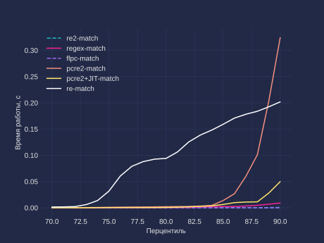

# regexp-performance
Benchmark of different python regexp libraries on some edge cases



## How to run?

- Environment variable `RUNS` specifies number of runs for each call.
  - Recommended value is 11.
- Some libraries requires extra system libraries to be installed.
- I recommend Podman/Docker
  - [Podman](https://podman.io/) allows to run container in rootless mode with no effort.

### Without building
Recommended variant to "just run on my machine"

```bash
docker run --rm  -v $(pwd)/docker-out:/app/graphs -e RUNS=11 ghcr.io/alekseylobanov/regexp-performance:latest python measure_performance.py
```

Result images will be placed in `./docker-out` directory.


### Podman/Docker

```bash
docker build -t re-benchmark .
docker run --rm  -v $(pwd)/docker-out:/app/graphs -e RUNS=11 re-benchmark  python measure_performance.py
```

Recommended variant if local building is preferred.

Result images will be placed in `./docker-out` directory.


### Pip/venv
**NB:** Additional libraries may be required.

```bash
python3 -m venv venv
source venv/bin/activate
pip install -r requirements.txt
RUNS=11 python measure_performance.py
```

Result images will be placed in `./graphs` directory.
